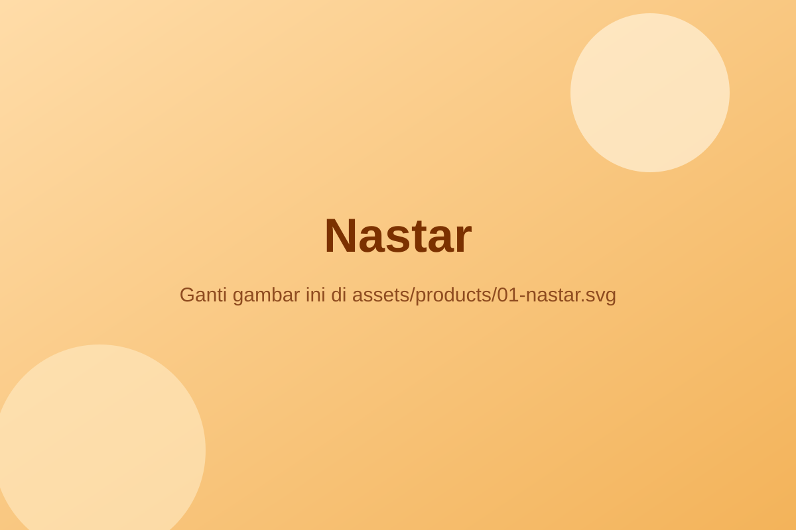

# Cara Ganti Gambar Produk JoeJoe Bakery

Semua gambar produk ada di folder:

- `assets/products/`

Total ada **11 gambar** dengan nama:

1. `01-nastar.svg`
2. `02-kastengel.svg`
3. `03-almond-cookies.svg`
4. `04-putri-salju.svg`
5. `05-cornflake-vanilla.svg`
6. `06-lidah-kucing.svg`
7. `07-coklat-candy.svg`
8. `08-coklat-kurma.svg`
9. `09-sagu-keju.svg`
10. `10-kacang-mede.svg`
11. `11-kue-coklat.svg`

## Langkah cepat

- Siapkan gambar baru Anda (lebih bagus jika rasio landscape, contoh 1200x800).
- Ganti file di folder `assets/products/` dengan nama file yang sama.
- Jika Anda ingin memakai `.jpg` atau `.png`, ubah juga ekstensi pada atribut `src` di `index.html`.

Contoh:

Dari:

```html

```

Menjadi:

```html

```
